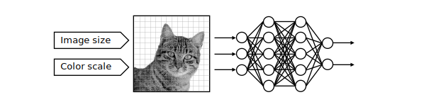

# Goals

OpenAE is an open, collaborative platform focused on advancing data-driven methods in the field of acoustic emission:

1. [Open standard for feature algorithm definitions](/standards/features/). Each feature is identified by an ID and a version. Models can use those identifiers to unambiguously specify its inputs.
2. [Implementations in different programming languages](/library/) to compute features in different environments and on different targets.
3. [Share and reuse trained models](/models/) based on those standardized features. Models can reused in similar applications or new applications by utilizing transfer learning.

   

## Inspiration

Transfer learning is a common practice in other domains like computer vision. With the rise of deep learning, modern computer vision models directly use the raw image data as the input without relying on handcrafted features or explicit domain knowledge. Only minor pre-processing (resizing, normalization and color space transformation) of the images is necessary to feed them into the deep learning model. Specific models can be built by utilizing a pre-trained model, such as ResNet, that has been trained on a large-scale dataset like ImageNet, which contains millions of images across various categories. Only the last layers (classification layers) of the model have to be re-trained for the new task. This approach allows the model to benefit from the large-scale pre-training dataset, even with limited labeled data. Overall, transfer learning accelerates training, improves model performance, and enhances generalization on the target task.

## Challenges

The world of AE-based monitoring is very different. Data sets of failure cases are usually rare and not sufficient to train models with the raw sensor data directly (deep learning). Instead, handcrafted features and domain knowledge are necessary to utilize machine learning. Overall, the signal path from the sensor to the decision-making is influenced by a lot of factors:

- structure and dispersion
- sensor sensitivity and mounting
- acquisition settings, e.g. digital filters
- feature extraction algorithms and parameters

Feature extraction is a crucial element in the signal path. Features like spectral centroid, band energies or ASL are widely used, but can differ in implementation details. Consequently, models fed with those features yield other results depending on the implementation of the mathematical algorithm.

OpenAE targets these challenges by defining a common set of feature extraction algorithms and providing an infrastructure to **share knowledge and models for data-base decisions**.

Interested? We encourage you to engage and [contribute](/project/contribute).
